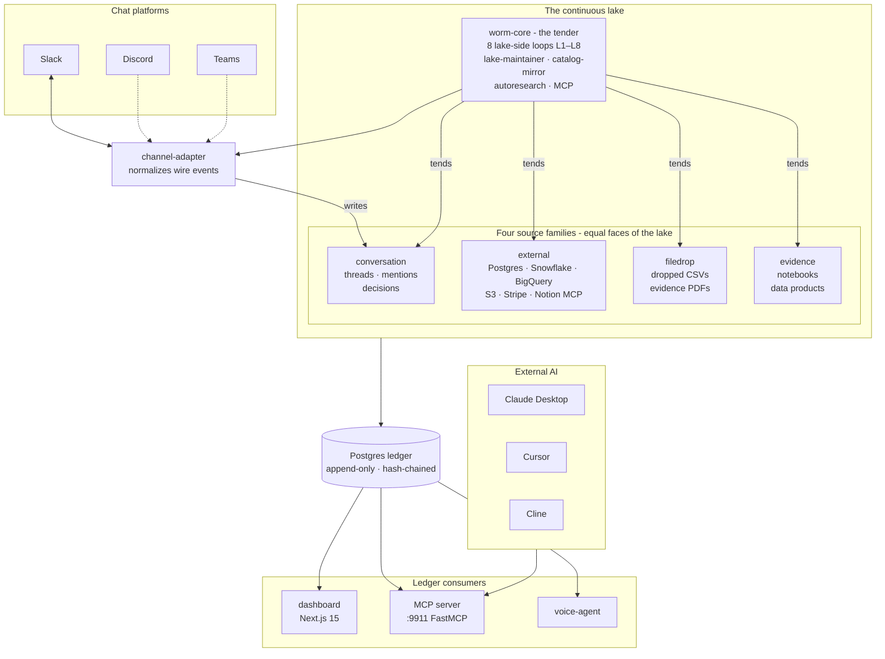

# WormBase

**WormBase is the agent-installable continuous lake.** It is **two
installations** — one into your chat platform (Slack / Discord / Teams),
one into your data lake — and the lake install has two paths:
**build or connect**. Build bootstraps a fresh local lake (csv / sqlite /
parquet under `~/.wormbase/lake/`) for prospects who don't yet have a
warehouse; connect installs into your existing Postgres, Snowflake,
BigQuery, S3 lakehouse, or MCP-bridged surface (Notion, HubSpot, Linear,
Atlassian). Both paths end at the same state: a continuous, governed,
agent-tended lake.

From the moment of install, the lake is continuous and agent-operated.
The agent and the lake **co-emerge** — there is no pre-existing lake
that the agent then arrives to operate. The lake exists because the
agent is tending it. Eight lake-side loops (L1–L8) continuously tend
its state; four source families (`external`, `filedrop`,
`conversation`, `evidence`) are equally lake-resident; every action is
hash-chained from an append-only Postgres **ledger** — the substrate
every projection (KPIs, decisions, processes, sources, people, data
products, MCP audit) folds from.

The chat install is the install channel and the audit channel. It is
where humans onboard, ask questions, and hear what changed. The lake
install is where the worm acquires its first non-conversation surface.
Both fire the same `propose → execute → verify → resolve → trace`
ledger sequence; both activate the same eight lake-side loops; both
become equally tended.

The product surface is **deterministic, auditable, and unprompted**
(a16z Institutional AI), backed by a **compounding wiki of
organizational truth** (Karpathy LLM-Wiki), driven by a
**metric-governed self-improvement loop** (Karpathy autoresearch). The
conversational edge is probabilistic; the writes to the ledger are
gated and replayable.

For the full thesis, read
[`docs/architecture/continuous-lake.md`](docs/architecture/continuous-lake.md)
and [ADR-0013](docs/architecture/decisions/ADR-0013-continuous-lake-philosophy.md).

This repository ships the worm itself, the dashboard, every channel
adapter, every lake surface, the ledger, the autoresearch loop, the
voice agent, the simulation harness, and an MCP server that exposes
the worm's institutional knowledge to external AI clients (Claude
Desktop, Cursor, Cline, custom agents).

---

## Quickstart

A fresh clone reaches a working multi-tenant install in **under 90 seconds**
on a laptop with Docker / OrbStack already running.

```bash
git clone https://github.com/ricalanis/wormbase-oss.git
cd wormbase-oss
cp .env.example .env       # edit the two required keys (see below)
make tutorial              # cold-start → working install + dashboard at :3000
```

`make tutorial` runs `make doctor` first, refuses to proceed if any precondition
is red, then brings up the stack, applies pending DB migrations, seeds two demo
tenants (`baseworm`, `democorp`), and opens the post-install welcome page in
your browser. If any beat fails, the console prints the exact recovery command.

### Required `.env` keys

The two keys you must supply for the happy path:

| Key | Why | How to get it |
|---|---|---|
| `OLLAMA_API_KEY` | Inference router (commodity own-inference path — Gemma 4) | <https://ollama.com> account |
| `WORMBASE_LEDGER_API_TOKEN` | Bearer the dashboard uses to call worm-core | Generate any random 32-byte hex; same string in both places |

Optional but recommended for the full Slack OAuth demo (see
[`docs/setup/slack-oauth.md`](docs/setup/slack-oauth.md)):

| Key | When |
|---|---|
| `SLACK_CLIENT_ID` / `SLACK_CLIENT_SECRET` | Real OAuth flow against a Slack workspace you control |
| `WORMBASE_DASHBOARD_URL` | Public HTTPS URL Slack can reach (set automatically by `make tunnel`) |
| `SLACK_BOT_TOKEN_BASEWORM` | Dev seed alternative — pre-issued bot token, skips the OAuth UI |

Everything else in `.env.example` has a working default for local dev.

### Verify the install

```bash
make doctor       # green/yellow/red status of every dependency
make ps           # docker compose ps
curl -sS http://localhost:3000/                  # dashboard
curl -sS http://localhost:8910/api/v1/health     # worm-core
```

Open <http://localhost:3000>. You should land on `/onboarding/welcome` if the
seed wrote an `Install` row, or on `/onboarding` if you skipped the seed and
need to run the live OAuth flow.

---

## Architecture at a glance

The **continuous lake is at the center**. Surfaces are the four equal
faces of the lake (`conversation`, `external`, `filedrop`, `evidence`).
**Worm-core sits inside the lake** as the tender — operator, not
consumer. Chat platforms are a tending channel into the lake, not a
separate input feeding a separate pipeline. The Postgres ledger is the
substrate below; every write is hash-chained; every projection (KPIs,
decisions, processes, sources, people, data products, MCP audit) is a
fold of the ledger.



Key visual properties:

- **Lake at the center**, not at the bottom of a pipe.
- **Surfaces as faces**, four equal families — none privileged.
- **Worm-core inside the lake** as the tender — operator, not consumer.
- **Ledger below the lake** as the substrate every action chains from.
- **Chat platforms as a tending channel**, not a separate input source.

The two non-negotiable properties:

1. **The dashboard reads only ledger projections.** It never reads sim state, never
   loads fixtures in production, never knows whether the actor was a real human
   or an LLM-driven persona on real Slack. It only knows the ledger says X
   happened.
2. **The channel-adapter is the only writer of flow-driven entries.** No
   `simulate-flows`, no demo-only seams. Determinism backstop is `wire-replay`:
   recorded JSONL of `InfraEvent`s fed back through the production
   channel-adapter.

Full design: [`docs/architecture-overview.md`](docs/architecture-overview.md).
Continuous-lake thesis:
[`docs/architecture/continuous-lake.md`](docs/architecture/continuous-lake.md).

---

## Tending the continuous lake

The lake doesn't stay still after install. Eight **lake-side loops**
continuously tend its state, each one a named axis along which the
agent is keeping the lake honest from t=0:

| Loop | Tending behavior |
|---|---|
| **L1** | Triages candidate sources mentioned in conversation → proposes new surfaces |
| **L2** | Detects catalog drift in connected surfaces → acknowledges or flags |
| **L3** | Discovers lineage edges between tables and columns → confirms or revises |
| **L4** | Computes schema-impact when surfaces change → elevates governance |
| **L5** | Fingerprints columns → identifies semantic types across the lake |
| **L6** | Classifies columns (PII / confidential / regulated) → confirms or escalates |
| **L7** | Runs quality checks → emits findings to the ledger |
| **L8** | Stitches entities across surfaces → resolves identity |

All eight run concurrently from t=0 of install. Cross-axis chains
(L5 → L7, L6 → L4, L5 → L4, L4 ↦ L2) compose individual loops into
multi-step inferences without coupling them. The **lake-maintainer**
dispatches `MaintainableSource` Protocol calls (drift detection,
classification refresh, staleness signals, lineage health) across
every surface family; the **catalog-mirror** keeps every external
surface's catalog imported into ledger entries the loops can read
from.

The mental model: **tending is the verb; the lake is the noun; the
eight loops are the grammar.** Where a vendor in this space says
"self-healing pipeline" or "active metadata," translate to "one of our
eight lake-side loops, expressed in their vocabulary."

See [`docs/architecture/lake-side-loops.md`](docs/architecture/lake-side-loops.md)
for the full L1–L8 reference, the cross-axis chains, and how loops
compose via the `LakeLoopComposite[T]` pattern.

---

## Service surface

| Service | Port | Tech | What it does |
|---|---|---|---|
| `dashboard` | 3000 | Next.js 15, TypeScript, React 19 | The product UI. 19 tabs. Reads ledger; writes via worm-core API. |
| `worm-core` | 8910 | Python 3.12, aiohttp | The brain. Reactivity loops, source-builder, autoresearch, write API, MCP server. |
| `channel-adapter` | — | Python 3.12 | Subscribes to OpenClaw events; writes `emit_chat_received` / `emit_file_received` / `emit_chat_sent`. |
| `sim-harness` | — | Python 3.12 | LLM-driven personas drive real Slack workspace via bot tokens. Wire-record / wire-replay. |
| `voice-agent` | 9912 | Python 3.12, FastAPI | ElevenLabs ear/mouth + Kimi brain via custom-LLM webhook. |
| `openclaw` | 8765 | Go (vendored) | Multi-platform chat gateway. Slack, Discord, Teams, WhatsApp, Signal, etc. |
| `postgres` | 5432 | Postgres 16 | Single source of truth — ledger + every projection table. |
| `localstack` | 4566 | LocalStack | S3-compatible object storage for data products + notebooks. |
| `tunnel` | — | cloudflared | Profile-gated quick-tunnel for OAuth (`make tunnel`). |
| `mcp` | 9911 | FastMCP 3.0 (inside worm-core) | Outbound MCP server — tools, resources, prompts for external AI clients. |

`docker-compose.yml` lives at `infra/docker-compose.yml`. The `oauth` profile
gates the tunnel sidecar so `make up` stays fast for non-OAuth dev.

---

## The dashboard tabs

Each tab is a server component reading ledger projections; per-tab user guide
under [`docs/user-guide/`](docs/user-guide/).

| Tab | What it shows | Daily for | Guide |
|---|---|---|---|
| `/onboarding` | Tier 0 chat-platform connect; default lake auto-provisions | Installer | [onboarding.md](docs/user-guide/onboarding.md) |
| `/dashboard` | Ramp gauges, time-to-aha, worm activity tile | Member | (see onboarding) |
| `/sources` | Connected sources + medallion freshness; default lake at top | Data engineer | [sources.md](docs/user-guide/sources.md) |
| `/people` | Roster, pending proposals, identity merge, role grants | Admin | [people.md](docs/user-guide/people.md) |
| `/kpis` | KPI tree (React Flow); propose / confirm / retire | CFO, CMO | [kpis.md](docs/user-guide/kpis.md) |
| `/decisions` | Decisions extracted from chat; recurring questions sidebar | COO | [decisions.md](docs/user-guide/decisions.md) |
| `/processes` | Auto-built process maps (swimlane diagrams) | COO | [processes.md](docs/user-guide/processes.md) |
| `/data-products` | Tracked, replayable artifacts with provenance | Every role | [data-products.md](docs/user-guide/data-products.md) |
| `/notebooks` | Authored / autoresearch-published notebooks; replay; sign | Data engineer, CFO | [notebooks.md](docs/user-guide/notebooks.md) |
| `/research` | Per-user autoresearch loop; approve / reject experiments | Every role | [research.md](docs/user-guide/research.md) |
| `/mcp` | MCP catalog + audit log (admin-only) | Admin | [mcp.md](docs/user-guide/mcp.md) |
| `/trace` | Filterable raw ledger; click-through to entries | Observer | [trace.md](docs/user-guide/trace.md) |
| `/ops` | Live health: postgres, ledger throughput, agent loops | Admin | [ops.md](docs/user-guide/ops.md) |
| `/activity` | Recent conversations, tasks, insights | Member | [activity.md](docs/user-guide/activity.md) |
| `/channels` | Per-platform Install + per-channel talkativeness dial | Admin | [channels.md](docs/user-guide/channels.md) |
| `/domains` | Per-domain card grid + owner + resources | Admin | [domains.md](docs/user-guide/domains.md) |
| `/policies` | Rule-as-code policies + last-fired counts | Admin | [policies.md](docs/user-guide/policies.md) |
| `/system-map` | Org graph (people + channels + edges) | COO | [system-map.md](docs/user-guide/system-map.md) |
| `/topics` | Silver-conversations topic clusters | Member | [topics.md](docs/user-guide/topics.md) |
| `/settings` | Tenant config, setup mode, tokens | Admin | [settings.md](docs/user-guide/settings.md) |

---

## The product arc — five steps

The customer journey and the demo arc are the same five steps. Each is a
canonical phase of the product, mapped to the architectural principles in
[`ARCHITECTURE.md`](ARCHITECTURE.md) and to ledger entries that fire when the
step happens.

1. **INSTALL.** Two installations, one product. The chat install
   (`@connect slack` / `discord` / `teams`) wires a channel adapter to
   worm-core and the worm begins lurking — every message is bronze
   ingestion on the conversation surface from the first wire event. The
   lake install is **build or connect**: build bootstraps the default
   local lake at `~/.wormbase/lake/{bronze,silver,gold}/` (for prospects
   without an existing warehouse); connect installs into an existing
   Postgres, Snowflake, BigQuery, S3, Stripe, or MCP-bridged surface
   (Notion, HubSpot, Linear, Atlassian). Both paths fire
   `propose → execute → verify → resolve → trace`; persons auto-discover
   from the first wire event.
2. **TEND.** Eight lake-side loops (L1–L8) tend the lake continuously
   from t=0 of install — drift detection, lineage discovery,
   schema-impact, semantic typing, governance classification, quality
   checks, entity stitching, candidate-source triage. The
   lake-maintainer dispatches the `MaintainableSource` Protocol across
   every surface family; the catalog-mirror keeps every external
   surface's catalog hash-chained into the ledger. Six source-building
   flows (`drop_and_profile`, `credential_in_dm`,
   `mentioned_in_conversation`, `dashboard_form`, `kpi_gap_triggered`,
   `lake_discovery`) all funnel into the same `source_proposed →
   source_confirmed → source_connected → source_profiled` lifecycle.
3. **COMPOUND.** Knowledge accumulates per `[[ledger]]` entry and per
   axis. KPIs in a tree, governance over every resource, processes
   retrieved from conversation history all grow concurrently from the
   same substrate. Cross-axis chains (L5 → L7, L6 → L4, L5 → L4, L4 ↦ L2)
   compose individual lake-side loops into multi-step inferences without
   coupling them. Every loop's confirmed-state output is available as a
   Reader Protocol for any other loop to chain off.
4. **PRODUCE + CONVERSE.** Data products generated from the lake. Text
   (Slack mentions) and voice (ElevenLabs + Kimi). Every answer is
   receipt-backed and replayable from the ledger.
5. **SELF-IMPROVE PER USER.** Karpathy-style autoresearch loop, parameterized
   by each user's role/position. Each Person gets their own analyst seat
   that gets sharper over time.

The 8-beat install demo arc demonstrates all five steps in ~5.5 minutes. The
scenario YAML driving the live arc is
`apps/sim-harness/scenarios/install-arc-7beat.yml`.

---

## Setup paths

### A) Localhost-only dev (default)

Use this when you're iterating on the dashboard, worm-core logic, or the sim
harness — no real OAuth, no real Slack workspace required.

```bash
cp .env.example .env
make tutorial          # full happy path
# OR step-by-step:
make up                # docker compose up
make seed              # provision demo workspace state for baseworm + democorp
open http://localhost:3000
```

The seed runs without touching Slack — sim-harness uses recorded fixtures and
the bot tokens declared in `.env`. The `make tutorial` path also opens
`/onboarding/welcome` once the install row lands.

### B) With cloudflared tunnel for real OAuth

Use this when you want to exercise the full Slack OAuth flow against a real
workspace — what a customer pilot does on day one.

```bash
make tunnel                # opt-in oauth profile; mints https://<random>.trycloudflare.com
make dashboard-restart     # picks up WORMBASE_DASHBOARD_URL from .env.tunnel
# 1. Create a Slack app at https://api.slack.com/apps
#    (paste docs/slack-sim-manifest.json)
# 2. Set redirect URL to ${WORMBASE_DASHBOARD_URL}/onboarding/oauth/slack/callback
# 3. Copy Client ID + Client Secret into .env, restart dashboard.
# 4. Click "Connect to Slack" on /onboarding.
make tunnel-down           # tear it all down
```

Full Slack-app-creation guide (with screenshots-described-in-text) is in
[`docs/setup/slack-oauth.md`](docs/setup/slack-oauth.md). Tunnel trade-offs
(quick vs named, ngrok parity, production reverse proxy) in
[`docs/setup/tunnel.md`](docs/setup/tunnel.md).

### C) Production deploy

Production runs the same code path — only credentials and KMS wrapping change.

- **Public HTTPS** for the dashboard (your reverse proxy or named tunnel).
  Set `WORMBASE_DASHBOARD_URL` directly; do **not** call `make tunnel`.
- **Real KMS** for OAuth grant wrapping: set `WORMBASE_KMS_KEY_ID` to the ARN
  of an AWS KMS CMK, and set `WORMBASE_REQUIRE_KMS=1` so the dashboard refuses
  the dev `vault://local-dev/...` fallback.
- **Real S3** for data products + notebooks: drop LocalStack, point
  `WORMBASE_S3_ENDPOINT` at AWS, set `AWS_ACCESS_KEY_ID` /
  `AWS_SECRET_ACCESS_KEY` (or use IAM role on the host).
- **Per-tenant inference endpoint** for own-inference (Gemma 4) on a private
  VLAN. SaaS shares one endpoint hosted by WormBase; on-prem customers run
  their own.

Acceptance gate: `make doctor` reports green on a freshly-provisioned host
with no host-level installs other than Docker / Docker Compose.

---

## Contributing

### Read the project documents first

Two governing documents shape every contribution:

1. **[`ARCHITECTURE.md`](ARCHITECTURE.md)** — durable architectural pins:
   substrate (PEVR + ledger + projections), worm decomposition,
   SurfaceDriver + ChannelAdapter contracts, identity model, role
   facets, install lifecycle, cleanup invariants (the always-on "no
   demo seams" list).
2. **[`DEVELOPERS.md`](DEVELOPERS.md)** — agent-orchestrated contribution
   patterns: the dispatch primitive, attention-handoff posture,
   parallel-worktree discipline, close-out as compounding state.

Architectural Decision Records live in
[`docs/architecture/decisions/`](docs/architecture/decisions/). Canonical
design specs (PRD-grade) in `docs/superpowers/specs/`. If a spec conflicts
with an older one, the newer spec wins; update the older one in the same
commit.

### Adding a new lake surface

A lake surface is a managed face of the continuous lake. To add one,
implement the `SurfaceDriver` Protocol and register it. (Paths and
class names below reflect post-Wave-D state — see
[ADR-0013](docs/architecture/decisions/ADR-0013-continuous-lake-philosophy.md)
and the rename plan in
[`docs/superpowers/specs/2026-05-17-continuous-lake-philosophy-design.md`](docs/superpowers/specs/2026-05-17-continuous-lake-philosophy-design.md)
§10.)

1. Create `packages/lake-surfaces/src/wormbase_lake_surfaces/<your_kind>.py`
   implementing the `SurfaceDriver` Protocol (`authenticate`, `discover`,
   `profile`, `sample`, `watch`). External and filedrop surfaces also
   implement `AcquirableSource`; every family implements
   `MaintainableSource` (drift / classification / staleness / lineage).
2. Add a registry entry via `register_surface_driver` in
   `packages/lake-surfaces/src/wormbase_lake_surfaces/registry.py`.
3. Provide a JSON-schema config so the dashboard's `/sources/new` lake
   surface picker can render a form (the schema lives next to your
   surface driver class).
4. Add an integration test against a recorded fixture in
   `tests/lake-surfaces/test_<your_kind>.py`.
5. **No core code ever changes** — that's the invariant. If you find yourself
   editing source-builder flows or lake-maintainer dispatch logic, you're
   doing it wrong. The eight lake-side loops will pick the new surface
   up automatically once it lands in the registry.

### Adding a new channel adapter

1. Create `packages/channel-adapters/src/wormbase_channel_adapters/<your_platform>.py`
   implementing the `ChannelAdapter` Protocol (`authenticate`, `install`,
   `listen`, `send`, `list_workspace_members`).
2. Normalize every wire event to the canonical `InfraEvent` shape with both
   `platform_*` raw native ids AND the WormBase-internal `channel_id` /
   `person_id` UUIDs (resolved at ingest time).
3. Register an OAuth flow in
   `apps/dashboard/app/onboarding/oauth/[platform]/`.
4. The dashboard reasons about `channel_id` / `person_id` only; **never about
   `platform_*` fields**, except in `/channels` and `/people` merge surfaces.

### Adding a new dashboard tab

1. Create `apps/dashboard/app/(app)/<your-tab>/page.tsx` as a server
   component.
2. Read only ledger projections via `lib/ledger-client.ts`. **No fixture
   loads.** No `return FIXTURE` shortcuts.
3. Honest empty state — every panel must render meaningful content when
   Postgres is empty (see `components/chrome/EmptyState.tsx`).
4. Role-aware visibility — register the tab in `lib/role-nav.ts` with
   per-role daily / weekly cadence.
5. Suspense boundary + error boundary on every server fetch.
6. Component tests for empty / loaded / error states. The N2 demo gate
   (`tests/demo/test_N2_no_placeholders_on_screen.py`) enforces no silent
   panels at commit time.

### Tests + QA

```bash
make qa-fast              # L1 + L2 + L3 — pre-commit (~2 min)
make qa                   # adds L4 + L5 — pre-merge (~6 min)
make qa-pre-demo          # adds L6 demo gates — Tue/Wed dry runs
make qa-report            # per-layer pass/fail/skip table
```

Layers: L1 unit (pytest, vitest), L2 component (vitest + Playwright),
L3 contract (`tests/contract/`), L4 service (`-m service`), L5 integration
(`tests/integration/`), L6 demo (`tests/demo/`, F/Q/N gates). The hash-chain
verifier `make verify` confirms ledger integrity end-to-end.

### Cleanup checklist

[`ARCHITECTURE.md`](ARCHITECTURE.md) maintains the always-on cleanup checklist
— the bullet-list of demo-mindset leaks the N2 gate enforces. Read before any
non-trivial change.

---

## Documentation map

| Document | Purpose |
|---|---|
| `README.md` (this file) | Quickstart + service map + entry points |
| [`ARCHITECTURE.md`](ARCHITECTURE.md) | Durable architectural pins — substrate, worm decomposition, contracts, identity, roles, install lifecycle |
| [`DEVELOPERS.md`](DEVELOPERS.md) | Agent-orchestrated contribution patterns — dispatch primitive, attention handoff, parallel-worktree discipline |
| [`docs/architecture-overview.md`](docs/architecture-overview.md) | The Triad → EDITABLE/LOOP/HARNESS/TRACE → service architecture |
| [`docs/architecture/continuous-lake.md`](docs/architecture/continuous-lake.md) | The agent-installable continuous lake — umbrella thesis, two installations, four source families, positioning vs industry |
| [`docs/architecture/lake-side-loops.md`](docs/architecture/lake-side-loops.md) | Public-friendly L1–L8 reference for the eight tending behaviors + cross-axis chains |
| [`docs/architecture/decisions/ADR-0013-continuous-lake-philosophy.md`](docs/architecture/decisions/ADR-0013-continuous-lake-philosophy.md) | The architectural commitment behind co-emergent agent + lake |
| [`docs/architecture/decisions/`](docs/architecture/decisions/) | Architecture Decision Records (ADRs) — every load-bearing decision captured |
| [`docs/architecture/`](docs/architecture/) | Orchestration, synthesis, case-studies, performance, product subdirs |
| [`docs/DELIVERY_LOG.md`](docs/DELIVERY_LOG.md) | Chronological release register — every meaningful ship |
| [`docs/AUTONOMOUS_MAINTENANCE_PLAYBOOK.md`](docs/AUTONOMOUS_MAINTENANCE_PLAYBOOK.md) | How agent-orchestrated codebases sustain themselves |
| `docs/user-guide/<tab>.md` | Per-tab user guide — one page per dashboard surface |
| [`docs/setup/slack-oauth.md`](docs/setup/slack-oauth.md) | Slack OAuth setup (production + local dev + CLI seed) |
| [`docs/setup/tunnel.md`](docs/setup/tunnel.md) | Cloudflared tunnel sidecar — when, how, trade-offs |
| `docs/superpowers/specs/` | Canonical design specs (PRD-grade) |
| [`landing/index.html`](landing/index.html) | Static landing page (hostable on GitHub Pages) |

Every claim in the docs about an action that fires a ledger entry names the
entry kind (e.g. "writes `emit_kpi_proposed`"). Every reference to MCP follows
the **MCP-native institutional AI** headline (the audit substrate is the
wedge, not the catalog).

---

## License

License: TBD. The project is being open-sourced from a curated snapshot of a
private development repository; the final license posture is pending. Until a
license is published, treat the source as "all rights reserved, available for
reading and contribution under good-faith conventions."

---

## Status

WormBase ships an agent-orchestrated, ledger-substrated continuous lake
that installs into your chat platform, builds or connects to your data
lake, tends both continuously, and answers every question with
hash-chained receipts. The substrate is settled; the public surface is
still maturing.

- The **continuous-lake philosophy** is the load-bearing positioning —
  see [`docs/architecture/continuous-lake.md`](docs/architecture/continuous-lake.md)
  for the thesis, the four source families, the two installations, and
  the differentiation against bolt-on agentic layers.
- The architectural commitment is captured in
  [ADR-0013](docs/architecture/decisions/ADR-0013-continuous-lake-philosophy.md):
  the lake exists because the agent is tending it; agent and lake
  co-emerge from t=0.
- The eight lake-side loops (L1–L8) that continuously tend the lake are
  documented in
  [`docs/architecture/lake-side-loops.md`](docs/architecture/lake-side-loops.md).

See [`docs/DELIVERY_LOG.md`](docs/DELIVERY_LOG.md) for what has shipped,
and the
[`docs/architecture/decisions/`](docs/architecture/decisions/) ADRs for
the load-bearing decisions behind it.
