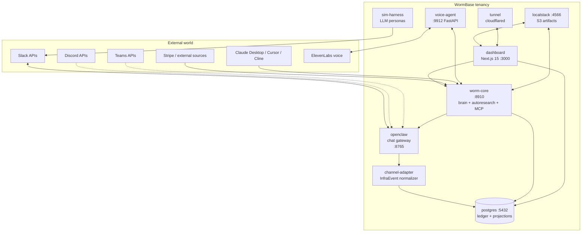

# Architecture overview

This document describes WormBase's architecture from three altitudes:

1. **Ideological spine** — the Triad (a16z institutional AI / Karpathy
   LLM-Wiki / Karpathy autoresearch) that anchors every design choice.
2. **Architectural spine** — EDITABLE / LOOP / HARNESS / TRACE — the four-layer
   refinement that instantiates the Triad in this codebase.
3. **Service architecture** — the six containers, their contracts, the data
   model, and how multi-tenancy + governance ride on the same substrate.

If a section conflicts with `docs/superpowers/specs/`, the spec wins. Update
this document in the same commit as the spec.

---

## 1. The Triad — ideological spine

Three 2026 pieces form the durable ideological spine of WormBase:

- **a16z, "Institutional AI vs Individual AI" (Feb 2026).** Winners are
  domain-specialized, deterministic, auditable, and **act unprompted**.
- **Karpathy, "LLM Wiki" gist (April 2026).** Knowledge is **compiled once,
  not re-derived on every query**. Synthesis at ingestion. RAG is amnesiac;
  the wiki is stateful.
- **Karpathy, autoresearch (March 2026).** Time-boxed loop, metric-governed,
  keep-what-wins, overnight-capable. "Research is now entirely the domain of
  autonomous swarms of AI agents."

These are not three ideas; they are three axes of one architecture.

| Axis | Anchor | WormBase specification |
|---|---|---|
| **Surface** (how the machine appears externally) | a16z institutional AI | Deterministic, auditable, unprompted, domain-specialized |
| **State** (how it remembers) | Karpathy LLM Wiki | Compounding, synthesized-at-ingestion, maintained at near-zero cost |
| **Motion** (how it improves) | Karpathy autoresearch | Time-boxed loop, metric-governed, keep-what-wins, overnight-capable |

WormBase's architecture instantiates the Triad, specialized to the data
function. The architectural tension to **name and not hide**: a16z
"institutional" implies slow, governed, risk-averse; Karpathy autoresearch
implies fast, hundreds of experiments per night. WormBase's reconciliation:
**the LOOP is fast; the HARNESS gates every iteration.** Speed from the loop,
trust from the gates. Governance is code, not process.

### The on-thesis criteria

Every feature is tested against eight criteria before shipping. Any feature
must hit ≥ 2 to ship; any demo must visibly instantiate ≥ 4.

| # | Criterion | What it tests |
|---|---|---|
| C1 | Unprompted action | Agent initiates work without being asked |
| C2 | Deterministic output | Same inputs → same outputs → same hashes |
| C3 | Compounding state | Knowledge compiled once, not re-derived |
| C4 | Near-zero maintenance cost | Agent does the bookkeeping humans abandon |
| C5 | Metric-governed self-improvement | Time-boxed loop with monotonic keep/discard |
| C6 | Auditable governance | Every action evidenced; gates block harmful moves |
| C7 | Domain specialization | Vertical depth, not general-purpose |
| C8 | Unprompted surface, prompted depth | Initiates on own; accepts direction when given |

---

## 2. EDITABLE / LOOP / HARNESS / TRACE — architectural spine

The Triad's three axes refine into four layers in this codebase. Each has a
clear mapping to source directories.

```
┌─────────────────────────────────────────────────────────────────────┐
│  EDITABLE  (the wiki — state)                                       │
│    medallion lake (bronze / silver / gold)                          │
│    KPI tree, decisions, processes, system map, topics               │
│    Persons, Installs, Identities, Domains, Resources, Policies       │
│    data products + notebooks (signed, replayable artifacts)         │
│  Compiled at ingestion. Maintained at near-zero cost.               │
│  ──────────────────────────────────────────────────────────────────│
│                                                                     │
│  LOOP      (the motion — every write)                               │
│    propose → execute → verify → resolve (PEVR)                      │
│    six source-building flows • autoresearch loop                    │
│    medallion cascade • setup conversation • identity discovery      │
│  Time-boxed. Metric-governed. Keep-what-wins.                       │
│  ──────────────────────────────────────────────────────────────────│
│                                                                     │
│  HARNESS   (the surface — gates)                                    │
│    relevance gate • classification gate • rate-limit gate            │
│    role-grant join • policy engine                                  │
│    OAuth flows • install orchestrator • write-action authorizer      │
│  Deterministic. Auditable. Unprompted. Domain-specialized.          │
│  ──────────────────────────────────────────────────────────────────│
│                                                                     │
│  TRACE     (the substrate — append-only ledger)                     │
│    company-scoped, hash-chained, replayable                         │
│    every write across all four quadrants writes a TRACE entry        │
│    every read view (KPIs, decisions, etc.) is a fold of TRACE        │
└─────────────────────────────────────────────────────────────────────┘
```

The principle: **TRACE is the substrate, not a side-channel.** Every
projection — KPIs, decisions, processes, sources, people, data products, MCP
audit, ramp gauges — is a materialized view over the ledger. Replay the
ledger to timestamp T to reproduce any state.

### Two speeds, four quadrants, one write primitive

WormBase has two operational speeds:

- **Passive** — lake builds, memory compounds, overnight loops.
- **Active** — channel conversations, KPI answers, reactive proposals.

Crossed with deterministic / probabilistic, these form four quadrants.
**Every write across all four quadrants uses the same primitive**:

```
propose → execute → verify → resolve → trace
```

This is the autoresearch loop generalized. Specializations live in the gates
and metrics, not in the loop structure.

| Quadrant | Speed | Determinism | Examples |
|---|---|---|---|
| Passive deterministic | passive | deterministic | medallion cascade, KPI re-fold, projection rebuild |
| Passive probabilistic | passive | probabilistic | autoresearch experiments, classifier retraining |
| Active deterministic | active | deterministic | KPI query with hash-pinned source bytes, governance writes |
| Active probabilistic | active | probabilistic | conversational reply (the LLM); proactive offer text |

The probabilistic edge is LLM-driven and stochastic by design (dialogue must
be alive). The core writes to the substrate are hash-stable and audit-complete.
**The gate between edge and core is where trust is enforced.** We do not trust
the LLM — we trust the gate between the LLM and the substrate.

---

## 3. Data model

### 3.1. The ledger

A single append-only Postgres table, hash-chained, company-scoped:

```
ledger_entries(
    entry_id        UUID  PRIMARY KEY,
    seq             BIGINT  NOT NULL,                  -- monotonic per company
    company_id      UUID  NOT NULL,
    kind            TEXT  NOT NULL,                    -- "emit_*" entry type
    quadrant        TEXT  NOT NULL,                    -- "propose"|"execute"|"verify"|"resolve"
    parent_entry_id UUID,                              -- PEVR chain link
    actor_id        UUID,                              -- person / agent / channel-adapter
    payload         JSONB NOT NULL,
    classification  TEXT,                              -- public|internal|confidential|pii|regulated
    domain_id       UUID,                              -- governance scope
    ts              TIMESTAMPTZ NOT NULL,
    payload_hash    TEXT  NOT NULL,                    -- sha256 of canonical payload
    chain_hash      TEXT  NOT NULL                     -- sha256(prev.chain_hash || payload_hash)
);
```

`make verify` walks the chain and asserts every `chain_hash` is reproducible.
A break is the highest-severity bug class in the system.

### 3.2. The PEVR primitive

Every business write is a four-entry chain:

```
propose      "I propose to do X with these args."
  └─ execute "I am doing X."
       └─ verify  "X completed and produced these bytes / this hash."
            └─ resolve "Outcome: keep | discard | rate_limited | error."
```

For low-risk writes (e.g. ingesting a chat message), all four quadrants land
in milliseconds. For autoresearch experiments, the cycle can span hours
(propose at t=0, execute on the next overnight run, verify against the metric
delta, resolve with `outcome: keep|discard`). The shape is the same.

### 3.3. Projections (the medallion)

Every read surface in the dashboard reads from a projection table populated
by `apps/worm-core/src/wormbase_core/projection_runner.py` folding the
ledger:

| Layer | Tables | Examples |
|---|---|---|
| **Bronze** | `bronze_*` | raw chat events, raw file bytes, raw API responses, conversation_messages |
| **Silver** | `silver_*` | parsed Persons, decisions, process maps, classified columns, recurring_questions |
| **Gold** | `gold_*` / `projection_*` | KPI tree, system map, ramp gauges, data products, notebooks |

Projections are **derived** — drop them and `projection_runner` rebuilds from
the ledger. Schema migrations live at
`packages/ledger/src/wormbase_ledger/projections/migrations/`; boot-time
`migrate(ledger)` applies pending migrations before any read/write
(W1.A1 — `feat(ledger): boot-time schema migrations`).

### 3.4. Identity model

Three durable concepts, each a ledger-projected table:

```
Person          {id, tenant_id, name, email, position, status,
                 proposed_by, confirmed_by, created_at}

PersonIdentity  {id, person_id, platform, platform_user_id,
                 display_name, email_at_platform, avatar_url, added_at}

Install         {id, tenant_id, platform, installer_person_id,
                 oauth_grant_ref, status, scopes, bot_user_id,
                 setup_mode, setup_completed_at, installed_at}
```

- **One `Person` per real human** (or service account) per tenant.
- **`PersonIdentity`** is the multi-platform fanout. `@bob` on Slack +
  `bob#1234` on Discord = two `PersonIdentity` rows pointing at one
  `person_id`.
- **`Install`** is the OAuth grant — one per `(tenant, platform)`, with the
  installer linked.

Auto-discovery: any unknown `platform_user_id` in a wire event triggers
`emit_person_proposed`. The discovery loop fetches workspace member metadata,
attempts an email-match against existing Persons, and either proposes a new
`Person + PersonIdentity` or proposes an identity link to an existing Person.
Admins confirm via `/people` (writes `emit_person_confirmed` /
`emit_identity_linked`).

### 3.5. Roles — three independent facets

A Person holds N grants across all three facets simultaneously, independent
and composable:

| Facet | Roles | Ledger entry |
|---|---|---|
| **Tenancy** | installer / admin / member / observer | `emit_role_assigned` |
| **Domain** | owner / contributor | `emit_domain_role_assigned` |
| **Resource** | maintainer / contributor | `emit_resource_role_assigned` |

Carol can be `tenancy.admin + domain.owner(finance) +
resource.maintainer(kpi.q3_net_revenue)` — three independent grants. The
`/people` surface renders a Person's full role surface as a flat join. The
dashboard's `useNavForRole(person)` hook maps role facets to nav items so the
chrome adapts to whoever is signed in.

### 3.6. Tenant model

`company_id` (or `tenant_id`) is the universal scope. Every ledger entry
carries one; every projection table is keyed by it; every dashboard query
filters by it. The header chip allows switching live; switching writes a
`dashboard.tenant_switched` ledger entry on every flip — the same hook the
multitenancy gate uses for telemetry.

Customer data lives in the customer's lake (remote read where possible);
embeddings, memory, and the ledger live in WormBase tenancy. On-prem / local
is available as a premium option with the same code path.

---

## 4. Service architecture

WormBase decomposes into six runtime services + a vendored chat gateway,
each a single docker-compose service. The wire is `docker-compose.yml` at
`infra/docker-compose.yml`.



### 4.1. `worm-core` — the brain

`apps/worm-core/`. Python 3.12, aiohttp. Hosts:

- **Reactivity loops** — chat poller, file poller, identity discovery,
  process extractor, autoresearch loop, setup conversation loop.
- **Source builder** — implements the six source-building flows; calls into
  `packages/lake-surfaces/` for per-source profiling.
- **Write-actions API** — `POST /api/v1/installs`, `POST /api/v1/people`,
  `POST /api/v1/kpis/propose`, `POST /api/v1/data-products/{id}/replay`,
  etc. Every write goes through a write-action that wraps the work in a PEVR
  chain.
- **MCP server** — outbound MCP server at `:9911/mcp` (Streamable HTTP via
  FastMCP 3.0). See § 5.
- **HTTP API** — `apps/worm-core/src/wormbase_core/http_api.py`. Bearer-token
  authed via `WORMBASE_LEDGER_API_TOKEN`.

CLI entrypoint: `wormbase-worm-core run`. Boot-time:
`migrate(ledger)` → `start_loops()` → `serve_http()` →
`serve_mcp()`.

### 4.2. `dashboard` — the surface

`apps/dashboard/`. Next.js 15 / TypeScript / React 19. Server components by
default; client components only where interactivity is needed (drawers,
modals, drag-and-drop, live polling).

- **Tabs** — 19 surfaces under `app/(app)/`. Each reads only ledger
  projections via `lib/ledger-client.ts`. Per-tab user guides in
  `docs/user-guide/`.
- **Onboarding** — `app/onboarding/` runs Tier 0 (chat-platform connect),
  the OAuth callbacks under `app/onboarding/oauth/[platform]/`, and the
  post-install welcome page (`/onboarding/welcome`).
- **API routes** — `app/api/v1/` proxies write-actions to worm-core; SSE
  endpoints stream live ledger updates to the cascade panel and trace tab.
- **Role-aware nav** — `lib/role-nav.ts` maps role facets to nav items;
  `useNavForRole(person)` renders the chrome.
- **Tenant cookie** — `lib/tenant-cookies.ts` reads / writes the active
  `company_id`; the header chip is the user-facing switcher.

### 4.3. `channel-adapter` — the wire

`apps/channel-adapter/`. Subscribes to OpenClaw events; normalizes wire
events to `InfraEvent`s; writes ledger entries. **The only writer of
flow-driven entries.**

```python
InfraEvent {
  source: "channel_message" | "file_drop" | "dm" | "reaction" | "edit" | ...
  platform: "slack" | "discord" | "teams" | ...
  platform_channel_id: str          # raw native id
  channel_id: UUID                  # WormBase-internal stable id
  platform_user_id: str             # raw native id
  person_id: UUID | None            # WormBase-internal Person, resolved if known
  message_id: str
  ts: datetime
  text: str | None
  payload: dict
  company_id: UUID
}
```

The dashboard reasons about `channel_id` and `person_id` only — never about
platform-native ids, except in `/channels` and `/people` merge surfaces.

### 4.4. `sim-harness` — production-shaped simulation

`apps/sim-harness/`. LLM-driven personas drive **real chat platforms** with
real bot tokens. No flow-bypass. Personas:

- post real `chat.postMessage` calls
- upload real `files_upload_v2` payloads
- DM the worm via real `conversations.open`
- get auto-discovered as Persons via the same identity-discovery loop a
  real install uses

**Person provisioning** happens via worm-core's `/api/v1/people` — same path
the production install uses. No direct ledger writes from sim.

`wire-record` captures every `InfraEvent` to JSONL; `wire-replay` reads the
JSONL and feeds it through the **production** channel-adapter at production
speed. Same code path. Different input. This is the only acceptable
determinism backstop for the demo.

### 4.5. `voice-agent` — ear and mouth

`apps/voice-agent/`. FastAPI service. ElevenLabs Conversational AI for STT /
TTS, Kimi K2.6 brain via custom-LLM webhook. Every voice turn writes the
same ledger entries a chat turn writes (`emit_chat_received`,
`emit_kpi_query`, `emit_chat_sent`); the voice surface is just a different
edge into the same write-action API.

The dashboard renders a floating "Ask the worm" mic button (W3.A12) on
every page that calls `/api/v1/voice/ask` and renders the answer + ledger
receipt.

### 4.6. `openclaw` — multi-platform chat gateway

Vendored Go binary at `infra/openclaw/`. Subscribes to 50+ chat platforms
under one configuration. WormBase consumes its event JSONL log via
channel-adapter; never writes platform-specific code in core.

### 4.7. `postgres` + `localstack`

- **Postgres 16** is the canonical store. Ledger + every projection. Volume:
  `wormbase-postgres-data`. Migrations apply at boot.
- **LocalStack** provides S3 for data products and notebooks. Production
  swap is a config change (`WORMBASE_S3_ENDPOINT`).

### 4.8. `tunnel` — opt-in

`infra/Dockerfile.tunnel`. cloudflared sidecar. Brought up via
`make tunnel` (compose profile `oauth`). Writes the public HTTPS URL to a
shared volume; `make tunnel` upserts it into `.env.tunnel` so the dashboard
picks up `WORMBASE_DASHBOARD_URL` on restart.

---

## 5. The SurfaceDriver Protocol

Every data source — internal or external, push or pull, file or stream —
implements one Protocol:

```python
class SurfaceDriver(Protocol):
    kind: str                          # "stripe" | "snowflake" | "csv" | ...
    capability: set[Capability]        # {discover, profile, sample, watch}
    classification_hints: list[Hint]   # PII patterns, regulated-data signals
    status: ConnectorStatus            # production | preview | coming_soon

    async def authenticate(self, secrets) -> AuthHandle: ...
    async def discover(self, handle) -> list[ResourceProposal]: ...
    async def profile(self, handle, resource_id) -> Profile: ...
    async def sample(self, handle, resource_id, n) -> bytes: ...
    async def watch(self, handle, resource_id) -> AsyncIterator[Change]: ...
```

Day-one surface drivers at `packages/lake-surfaces/`: `csv_local`,
`postgres`, `snowflake`, `bigquery`, `s3_csv`, `stripe`, `salesforce`,
`hubspot`, `gsheets`, `http_csv`. Plus the default `local_lake` surface
driver that ships auto-provisioned per tenant during install (writes
`emit_source_proposed → emit_source_confirmed → emit_source_connected →
emit_source_profiled` for `local-lake://{tenant_id}`).

Adding a lake surface = adding a class + JSON-schema config + a registry
entry. **No core code ever changes.** Source-building flows
(`drop_and_profile`, `credential_in_dm`, `mentioned_in_conversation`,
`dashboard_form`, `kpi_gap_triggered`, `lake_discovery`) are
surface-driver-agnostic.

### Reactivity: infrastructure → semantic → relevance

Events arrive at the **infrastructure layer** (file landed, message
received, cron fired, webhook). The **semantic layer** interprets (classifier
/ ontology lookup). The **relevance gate** decides whether to react. Only
after all three does the worm act or speak. This is how reactivity stays
on-thesis and avoids chatbot-firehose behavior.

```
infra event → semantic classify → relevance gate → write-action
   (raw)         (ontology)         (gated)         (PEVR chain)
```

The gates carry budgets. Per-channel "max N clarifying questions per day"
is a gate-enforced budget logged to the ledger as `emit_clarify_asked` (with
discard if over budget). Talkativeness dial per channel:
`lurker / responsive / proactive`.

---

## 6. The ChannelAdapter Protocol

```python
class ChannelAdapter(Protocol):
    platform: Platform              # "slack" | "discord" | "teams" | ...
    capability: set[ChannelCap]     # {ingest, send, file_upload, dm, voice}

    async def authenticate(self, secrets) -> AuthHandle: ...
    async def install(self, handle) -> InstallRecord: ...
    async def listen(self, handle) -> AsyncIterator[InfraEvent]: ...
    async def send(self, handle, channel, msg) -> MessageRef: ...
    async def list_workspace_members(self, handle) -> list[PlatformMember]: ...
```

Day-one adapters live at `packages/channel-adapters/`:

- **slack** — full ingest, send, file_upload, dm. Production-grade.
- **discord** — stub-but-real: real bot account, real install flow, real
  listen loop. Send + file_upload are skeletal but the wire-event
  normalization is complete.
- **teams** — stub-but-real, same shape as Discord.

Every adapter normalizes wire events to the canonical `InfraEvent`. The
dashboard reasons about `channel_id` / `person_id`, never platform-native
fields, except in the `/channels` and `/people` merge surfaces.

---

## 7. MCP integration — bidirectional

WormBase is **MCP-native institutional AI**. The phrase has two halves —
**MCP-native** (the same surface the dashboard reads is exposed outbound
via the Model Context Protocol) and **institutional AI** (the gate between
the LLM and the substrate is deterministic; every call is a hash-chained
ledger row).

### 7.1. Outbound — WormBase as MCP server

`apps/worm-core/src/wormbase_core/mcp_server.py`. FastMCP 3.0 over
Streamable HTTP at `:9911/mcp`. The server exposes:

- **Tools** — model-controlled queries and proposals.
  - Read: `query_ledger`, `query_kpis`, `query_decisions`, `query_processes`,
    `query_data_products`, `query_notebooks`, `query_conversations`,
    `query_audit_trail`, `query_sources`, `query_people`,
    `query_recurring_questions`.
  - Write: `propose_data_product`, `propose_kpi`, `propose_source`,
    `confirm_proposal`, `discard_proposal`. All gated by role grants —
    `propose_*` requires `tenancy.member`+; `confirm_*` / `discard_*`
    requires `domain.owner` or `tenancy.admin`.
- **Resources** — URI-addressable read context.
  - `wormbase://ledger/{company_id}/recent`,
    `wormbase://kpis/{company_id}/tree`,
    `wormbase://decisions/{company_id}/{decision_id}`,
    `wormbase://data-products/{company_id}/{data_product_id}`,
    `wormbase://conversations/{company_id}/channels/{channel_id}`.
- **Prompts** — shareable templates that walk WormBase's domain primitives.
  The killer prompt is `audit_decision`, which walks
  `decision → process map → KPIs → source bytes` end-to-end and writes one
  `emit_mcp_call_received` (Beat 8 of the demo).

Auth is bearer-token v1 (per-Person tokens issued from
`/settings/tokens`); v2 upgrades to OAuth 2.1 with PKCE + Resource
Indicators (RFC 8707) for public remote deployments. Multi-tenant routing
is token-encoded for v1, path-encoded (`/api/v1/tenants/{id}/mcp`) for v2.

### 7.2. Inbound — `MCPSurfaceDriver(SurfaceDriver)`

`packages/lake-surfaces/src/wormbase_lake_surfaces/mcp.py`. An
`MCPSurfaceDriver` implementation lets the worm consume *any* external
MCP server (Notion, Atlassian, Linear, GitHub, Google Workspace, HubSpot,
dbt Cloud, Atlan, Glean, Monte Carlo) through the **same SurfaceDriver
contract** every other source uses. From the rest of the codebase's
perspective, an MCP-backed source is indistinguishable from a Postgres
source.

This preserves the PRD §2 invariant: **no core code ever changes** to add
a lake surface. Six MCP presets register via the same
`register_surface_driver(...)` pattern — `mcp:notion`, `mcp:atlassian`,
`mcp:linear`, `mcp:github`, `mcp:google_workspace`, `mcp:hubspot`. Each
preset is ~30 LOC.

### 7.3. The audit substrate is the wedge

Every MCP call writes:

```python
emit_mcp_call_received {
    company_id, caller_person_id, caller_client,
    tool_name | resource_uri,
    args_hash, classification, ts
}

emit_mcp_call_resolved {
    call_id, status: "ok"|"denied"|"rate_limited"|"error",
    rows_returned, output_hash, output_classification,
    duration_ms, ts
}
```

**Nobody else makes the MCP audit log a first-class customer artifact on a
hash-chained ledger.** Atlan / Glean / Atlassian / Notion / dbt / Monte
Carlo log to opaque internal stores. WormBase logs to the customer's own
ledger, governed by the same role facets and classifications that govern
the rest of the substrate. This is the unclaimed competitive position —
"the audit substrate for every AI agent that ever touched your data."

Full design and phased adoption plan in
[`docs/superpowers/specs/2026-04-27-mcp-integration.md`](superpowers/specs/2026-04-27-mcp-integration.md).

---

## 8. Multi-tenant model + governance

### 8.1. SaaS-first deployment

Hosted multi-tenant is the default. Every object is `company_id`-scoped.
Customer data lives in the customer's lake (remote read); embeddings,
memory, and ledger live in WormBase tenancy. On-prem / local is a premium
option with the same code path.

### 8.2. Ledger-native governance — five concepts

Governance does not install separately. It emerges from the ledger as
materialized views:

- **Person** `{id, name, email, role}` — role ∈ {admin, owner, member,
  observer}
- **Domain** `{id, name, default_classification, owner_person}` —
  functional area (sales, product, finance, etc.)
- **Resource** `{id, type, identifier, domain, owner_person,
  classification}` — type ∈ {source, table, model, mart, concept, kpi,
  policy}
- **Classification** — enum {public, internal, confidential, pii,
  regulated}
- **Policy** `{id, name, applies_to, rule, gate_impl}` — rule-as-code
  attached to domain × classification × resource

Every ledger entry is implicitly tagged with `domain_id` and
`classification` via the resource it touches. Governance views are
aggregations over the ledger — no separate database, no portal, no
workflow engine.

### 8.3. Pre-seeded governance expertise

SaaS / marketplace / fintech domain templates ship with the product.
Classification heuristics (PII patterns, etc.) are pre-loaded. Policy
templates (retention, masking, access) come with each domain pack.
Customer starts from a working baseline, not a blank canvas — confirmed
in Tier 2 of onboarding in ~90 seconds.

### 8.4. The principle

**Governance is code, not a binder.** Any rule that cannot be expressed as
a gate implementation is out of scope for this product — it belongs in a
policy document elsewhere. The HARNESS layer is where governance lives;
that is what makes the LOOP fast and the SURFACE auditable.

---

## 9. Inference architecture

Heterogeneous inference, routed by deterministic policy. The split is
**architectural**, not a vendor choice.

| Side | Model (current) | Where it runs | When |
|---|---|---|---|
| **Remote** (frontier reasoning) | Kimi K2.6 | Public API | Low-volume, high-stakes work — planning, conversational reply, voice brain |
| **Own** (commodity) | Gemma 4 (E4B default) | Private VLAN inference endpoint | High-volume — embeddings, classification, summarization, PII detection |

Both sides are swappable behind the router interface
(`packages/inference-router/`).

**Deployment by tenancy:**

- **SaaS tenants** — WormBase hosts the own-inference endpoint in our
  tenant VLAN. Customer data crosses a boundary only into WormBase tenancy.
  Kimi remote calls made server-side from the same VLAN.
- **On-prem / premium tenants** — customer hosts the own-inference endpoint
  on their VLAN. Customer data never crosses the customer's perimeter for
  commodity inference. Remote Kimi calls are the only external hop, and
  they can be proxied if required.
- **Demos** — own-inference endpoint hosted by WormBase on our VLAN; worm
  connects over VPN or direct private network. Demo machine carries no
  model weights.

**Inference locality is a governance commitment, not a performance
optimization.** The remote/own split enforces cost, latency, and
data-residency properties that would otherwise leak.

---

## 10. The two non-negotiable invariants

If you remember nothing else from this document:

1. **The dashboard reads only ledger projections.** No fixture loads in
   production code paths. No demo-only seams. If a flow doesn't fire
   end-to-end on the live wire, fix the wire — don't write to the ledger
   directly.
2. **The PEVR primitive is the one write.** Every write across all four
   quadrants — passive deterministic, passive probabilistic, active
   deterministic, active probabilistic — is `propose → execute → verify →
   resolve → trace`. Specializations live in the gates and metrics, not
   in the loop structure.

Everything else compiles from these two.

---

## See also

- [`README.md`](../README.md) — quickstart + service surface
- [`docs/demo-runbook.md`](demo-runbook.md) — the live install demo arc
- [`docs/user-guide/`](user-guide/) — per-tab user guides
- [`docs/superpowers/specs/2026-04-26-production-dashboard-and-identity.md`](superpowers/specs/2026-04-26-production-dashboard-and-identity.md)
  — canonical PRD
- [`docs/superpowers/specs/2026-04-26-wormbase-product-arc.md`](superpowers/specs/2026-04-26-wormbase-product-arc.md)
  — the 5-step product story
- [`docs/superpowers/specs/2026-04-27-mcp-integration.md`](superpowers/specs/2026-04-27-mcp-integration.md)
  — full MCP spec (10 dimensions + 5-phase plan)
- [`CLAUDE.md`](../CLAUDE.md) (project root) — durable agent instructions
- [`/Users/ricalanis/Dev/agentic_datasci/.claude/CLAUDE.md`](../../../.claude/CLAUDE.md)
  — repo-wide ideological anchors
