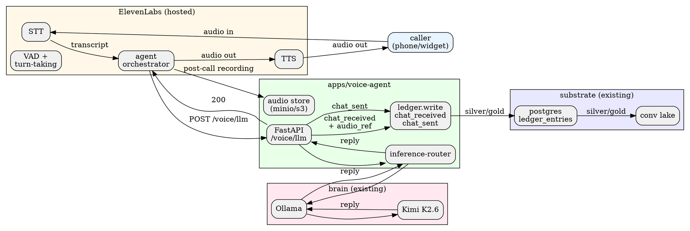

# Voice Agent — Design Doc

**Date:** 2026-04-26
**Status:** Spec; Wave 2 implementation pending.
**Owner:** WormBase team.
**Audience:** the implementation subagent (E) building the POC, plus reviewers.

This document specifies how WormBase grows a voice modality without
violating the institutional-AI thesis. It is *not* an implementation —
the next subagent reads this and writes code.

---

## 1. Goal

Add a voice surface to WormBase such that a user can **speak** to the
worm and the worm can **speak back**, with every exchange landing as
hash-chained ledger entries indistinguishable from text Slack chat.
Voice is a new modality on the same substrate, not a new product.

### Non-goals (Thursday)

- Outbound dialing (worm initiating calls).
- Multi-party conferencing (worm joining N>2 calls).
- Voice cloning / brand voice tuning.
- Real-time interruption / barge-in beyond the provider default.

### On-thesis criteria hit (target ≥4)

- **C1 unprompted action** — voice exchange triggers downstream
  reactivity exactly like a Slack mention; the worm can issue
  follow-up `clarify_asked` ledger entries unprompted.
- **C2 deterministic output** — the *substrate* response is hash-stable
  (transcript → KPI lookup → text answer). The TTS rendering is the
  probabilistic edge; the ledger entry is the deterministic core.
- **C3 compounding state** — voice transcripts flow into the same
  conversation lake (bronze → silver → gold) as Slack text. A six-month
  worm has six months of transcribed calls in its memory.
- **C6 auditable governance** — every utterance produces
  `chat_received` (with `audio_ref`) and `chat_sent` (with `audio_ref`)
  entries. Audio is content-addressed and replay-able.
- **C8 unprompted surface, prompted depth** — the voice channel
  *initiates* (greets caller), but accepts user direction once on the
  line.

Five of eight criteria. The voice beat is on-thesis.

### Triad mapping

- **Surface (a16z institutional)** — a voice line that answers with
  *evidenced* numbers, not hallucinated ones. The phone is institutional
  AI's most legible surface: a board member dials, and the worm
  answers like a CFO would, with ledger references attached.
- **State (Karpathy wiki)** — transcripts compound into the same lake
  as text; the wiki absorbs voice. Synthesis at ingestion (transcript
  → entity extraction → topic linking) happens once, not per query.
- **Motion (Karpathy autoresearch)** — every voice answer runs the
  same `propose → execute → verify → resolve` loop. Verify is the
  deterministic gate: no audio is rendered until the substrate has a
  hash-stable answer to read aloud.

---

## 2. Provider comparison

Latency is round-trip from end-of-user-utterance to start-of-agent-audio.
"Cost-per-min" is rough 2026 production pricing; reconfirm at
contract time.

| Provider | Latency | Cost / min | Integration cost | Demo-day risk | Recommendation |
|---|---|---|---|---|---|
| OpenAI Realtime API (gpt-realtime) | ~300–500 ms | ~$0.30 (model + audio in/out) | Low — single websocket; STT+LLM+TTS bundled | Medium — depends on OpenAI uptime; their reasoning model is *not* Kimi (our brain is Kimi); requires bridging | **Phase 2** if we want their voice quality, but their bundled LLM is the wrong brain |
| ElevenLabs Conversational AI | ~400–700 ms | ~$0.20–0.40 | Medium — orchestrator + agent SDK; routes inference to *our* LLM endpoint via webhook (this is the differentiator) | Low — production-grade, multiple SDKs, well-documented | **Recommended.** Their agent platform supports custom LLM hooks → Kimi-via-Ollama plugs in. TTS is best-in-class. |
| LiveKit Agents | ~500–800 ms | ~$0.05 (LiveKit) + STT/TTS/LLM separately | High — full pipeline assembly (STT vendor + LLM + TTS vendor + turn-taking) | Medium — proven, but multi-vendor wiring before Thursday is risky | Phase 2; correct architecturally for on-prem/VLAN deployments. |
| Pipecat | ~500–900 ms | infra only + STT/TTS/LLM | High — Python framework, very flexible, but you wire everything | High — too many DIY pieces for a 5-day window | Phase 2 reference; revisit for self-hosted track. |
| Slack Huddle bot APIs | n/a | n/a | n/a — Slack does not expose a programmable bot-in-huddle API in 2026 (RTC SDK is read-only for bots) | Blocking | **Not feasible.** |
| Twilio + custom STT/TTS | ~700–1500 ms | ~$0.014 (Twilio) + STT + TTS | Highest — STT (Deepgram) + LLM (Kimi) + TTS (ElevenLabs) + WebSocket Media Streams glue | High — most moving parts | Phase 2 if we want full ownership of the audio path. |
| OpenClaw `/voice` plugin (talk-voice) | unknown | unknown | unknown — registers at startup but the plugin's mandate appears to be **CLI voice control of the OpenClaw harness** (a tool for the agent operator), not an inbound caller surface for the agent itself | Investigation cost | **Investigate but do not depend on.** Likely the wrong abstraction for our demo. |

### What about OpenClaw `/voice`?

OpenClaw registers a `talk-voice` plugin at gateway startup (visible
in OpenClaw boot logs, not surfaced in our config). By naming
convention this is almost certainly **operator-facing** (the human
running OpenClaw can speak commands at it), not an inbound channel
for the agent to receive customer calls on. Implementation subagent:
spend ≤30 min confirming via OpenClaw source, then move on. Revisit
only if `/voice` turns out to expose an inbound audio channel.

---

## 3. Recommended stack

**ElevenLabs Conversational AI** as the voice front-end, configured
to call **Kimi K2.6 via our existing Ollama route** as its LLM. A new
service `apps/voice-agent/` owns the bridge.

**Why ElevenLabs over OpenAI Realtime:** OpenAI Realtime bundles the
reasoning LLM. We already have Kimi as our brain — the entire
"institutional" pitch hinges on heterogeneous routing (frontier vs
own-inference). Bringing in OpenAI's bundled LLM dilutes the story
*and* doubles our LLM bill. ElevenLabs lets us keep Kimi as the brain,
treat ElevenLabs as the ear and mouth, and stay on-thesis.

**Why ElevenLabs over LiveKit/Pipecat:** time. The 5-day window
favors hosted glue. LiveKit/Pipecat win in a self-hosted on-prem
deployment (Phase 2); Thursday's demo is hosted SaaS posture.

### Stack topology

```
caller phone / browser widget
         │
         ▼
  ElevenLabs Conv. AI agent
   ├── built-in STT (Whisper-class)
   ├── built-in turn-taking + VAD
   ├── built-in TTS (ElevenLabs voice)
   └── custom-LLM webhook ──► apps/voice-agent (FastAPI)
                                     │
                                     ├── transcript → ledger.write(chat_received, audio_ref)
                                     ├── route inference → Ollama / Kimi K2.6
                                     ├── reply text → ledger.write(chat_sent, audio_ref)
                                     └── return reply text → ElevenLabs renders TTS
```

### Component contract

`apps/voice-agent/` exposes one FastAPI service with three endpoints:

- `POST /voice/llm` — ElevenLabs custom-LLM webhook. Receives
  `{messages, session_id, agent_id, ...}`, writes `chat_received`,
  routes to Kimi via inference-router, writes `chat_sent`, returns
  the reply text. Request/response schema mirrors OpenAI chat
  completions (ElevenLabs supports this contract).
- `POST /voice/webhook/start` — fires when a session starts; opens a
  ledger conversation for this session.
- `POST /voice/webhook/end` — fires when a session ends; flushes the
  audio recording URL into a ledger `chat_session_closed` entry
  (new payload type, see §6).

The voice-agent service runs in the same docker-compose stack as
worm-core; it shares `wormbase-ledger`, `wormbase-inference-router`,
and `wormbase-governance` as workspace deps.

---

## 4. Demo scenario — chosen primary beat

**Pick (a) — phone call.** The investor (or a prearranged colleague)
dials a US toll-free number. The worm answers. The investor asks
*"what was Q3 net revenue versus Q2?"*. The worm answers with a
sourced number and references the ledger trace.

### Why phone over huddle / voice memo / browser widget

- **Phone is the most institutional surface.** It signals "this is the
  AI a board member would call." It maps cleanly to a16z's "AI auditor /
  AI third-party tester / AI board member" framing.
- **Slack Huddle is not feasible** (no programmable bot API in 2026).
- **Voice memo** is a good second beat (it shows ingest, not dialogue);
  defer to Phase 2 as a "passive voice ingest" feature.
- **Browser widget** is feasible but feels "chatbot-ish" — it dilutes
  the institutional-surface read. Keep as a fallback.

### Verbatim narrator beat (drop into `docs/demo-runbook.md`)

> **Stage** — Presenter holds up a phone, speakerphone on, room can hear.
> Dashboard `/activity` visible on the side monitor.
>
> **Narrator** — "WormBase isn't only in Slack. The same worm — same
> ledger, same Kimi, same gates — answers the phone."
>
> *Phone rings. Worm picks up.* **Worm** — "WormBase, baseworm tenant.
> Go ahead." **Presenter** — "What was Q3 net revenue versus Q2?"
> *~2s pause.* **Worm** — "Q3 net revenue was $4.2 million, up 12.4%
> versus Q2's $3.74 million. Source: sales-q3.csv, ingested 09:13 UTC.
> Trace at activity row 247."
>
> **Stage** — operator points to row 247: `propose: kpi_query →
> execute: kimi_call → verify: hash_chain → resolve: emit_chat_sent`.
> Channel is `voice:elevenlabs:<session>`.
>
> **Narrator** — "Same loop. Slack, phone, dashboard — three surfaces,
> one substrate, one trace."
>
> **Callout** — Triad: Surface + State. Rubric: C1, C2, C6, C8.

### Slot in the runbook

Lands between **Act 3** and **Q&A** (~30s after third @-mention,
before `make verify`). Adds ~90s of runtime; total moves 10–12 min →
12–14 min, within envelope.

---

## 5. Architecture diagram



The shape: **ElevenLabs is the ear and mouth. The voice-agent service
is the wire. Kimi is the brain. The ledger is the substrate.** The
voice-agent service is ~200 LOC of FastAPI plus tests — the same shape
as the channel-adapter for Slack.

---

## 6. Auditability mapping

Every voice exchange must produce ledger entries that look, replay,
and verify identically to Slack chat entries. The schema additions
are minimal — one new field on existing payloads, plus one new
session-scoped entry.

### Payload changes (proposed; subagent confirms with packages/ledger maintainer)

`ChatReceivedPayload` and `ChatSentPayload` gain an optional field:

```python
audio_ref: AudioRef | None = None

class AudioRef(BaseModel):
    storage_url: str          # s3://wormbase-audio/<tenant>/<session>/<uuid>.opus
    sha256: str               # content hash of the audio blob
    duration_ms: int
    transcript_method: Literal["elevenlabs-stt", "whisper-large-v3"]
    speaker: Literal["caller", "agent"]
```

Channel ID convention for voice:
`voice:elevenlabs:<session_id>` (text Slack channels are `slack:<channel_id>`).
The dashboard's existing channel filter renders both; no UI change
required.

### New entry type (session-scoped)

`ChatSessionClosedPayload` — fires on `/voice/webhook/end`:

```python
class ChatSessionClosedPayload(EntryPayload):
    kind: ClassVar[str] = "chat_session_closed"
    channel_id: str
    session_id: str
    started_at: datetime
    ended_at: datetime
    full_recording_url: str   # post-call concatenated audio
    full_recording_sha256: str
    transcript_url: str       # post-call transcript JSON
    turn_count: int
```

This entry closes the session and gives the dashboard one row to
click for "play the whole call." Individual `chat_received` /
`chat_sent` rows still hold per-utterance audio for fine-grained
replay.

### Replay guarantee

Replay-from-ledger reconstructs:

1. The transcript (every `chat_received.text` + `chat_sent.text`
   in session-id order).
2. The audio (every `audio_ref.storage_url` in order, fetched fresh
   from object storage; SHA-256 verified on fetch).
3. The Kimi calls (the `execute` row's `args` field carries the prompt;
   re-running it should produce the same reply hash, modulo Kimi
   non-determinism — that's why the gate is what we trust, not the
   LLM).

Hash chain extends across voice + text uniformly. `make verify` is
unchanged — it walks the ledger end-to-end without caring whether a
row came from a Slack message or a phone call.

### Storage

Audio blobs go to a MinIO bucket in dev (`infra/docker-compose.yml`
already has MinIO scaffolded for `gold-artifacts`; reuse the same
service with a second bucket `voice-audio`). Production uses S3 with
KMS encryption. The voice-agent service only writes URLs into the
ledger — never the audio bytes themselves. **Audio is content; the
ledger is the index.**

---

## 7. Out-of-scope for Thursday (Phase 2)

Implementation subagent should **not** build these.

- **Outbound dialing** (worm calls on-call eng on KPI break) —
  architecturally identical, different ElevenLabs surface.
- **Multi-party huddle** — Slack Huddle API closed; LiveKit could host.
- **Voice cloning** (brand-voice CEO tuning) — ElevenLabs supports it,
  pricing changes.
- **Browser voice widget** — embeddable widget hits the same webhook
  in ~30 LOC; defer unless ahead of schedule.
- **Voice ingest of memos / recordings** — Whisper-style STT on dropped
  MP3s; symmetric with file-drop flow.
- **Real-time tool use mid-call** — worm runs `make verify` while on
  phone; ElevenLabs supports it.
- **Multi-tenant phone numbers** — one number per tenant; Twilio matrix.
- **Speaker diarization** for multi-caller — research problem.

---

## 8. Risk register (top 5 for the implementation subagent)

1. **ElevenLabs custom-LLM webhook contract churn.** The webhook
   schema may have changed since this doc was written. Read the
   current ElevenLabs Conversational AI docs as the *first* step;
   this doc may be stale within 30 days. If their schema differs from
   OpenAI chat-completions, normalize at the FastAPI boundary.
2. **Kimi latency over Ollama remote.** If Kimi p95 is >2s, the voice
   feel breaks. Pre-warm with a hello-world ping at session start;
   if still slow, fall back to `gpt-oss:120b` (the configured
   fallback in `entrypoint.sh`) for voice only — text demos still
   use Kimi.
3. **Audio storage during the demo.** MinIO must be up. If MinIO
   wedges, the `audio_ref.storage_url` writes will 500 the FastAPI
   handler; ElevenLabs gets a 5xx and the call drops mid-utterance.
   Wrap audio storage in a best-effort try/except — log and continue
   if MinIO fails. The ledger entry should still write (with
   `audio_ref = null`); the demo survives without recordings.
4. **Phone-number provisioning.** ElevenLabs phone numbers need
   ~24–48h to provision in some regions. Order the number on
   Monday at the latest. Have a browser-widget fallback ready.
5. **Demo-day network.** A bad venue WiFi tanks the call. Tether to
   a phone hotspot for the demo machine. The voice-agent service
   should run locally; the only WAN dependency is ElevenLabs ↔ phone
   carrier and Kimi ↔ Ollama. Test on a hotspot during T-2 rehearsal.

Lower-priority: voice picking (neutral preset, test with coworker);
TTS numeric rendering ("$4.2 million" not "four dollar two million");
latency budget — STT (~200ms) + Kimi (~1500ms) + TTS first byte
(~300ms) ≈ 2s; target ≤2.5s, >3s feels broken.

---

## 9. Acceptance criteria (Wave 2 implementation done = these green)

The implementation subagent ships when:

- [ ] `apps/voice-agent` builds, lints, types, and tests pass.
- [ ] FastAPI service runs in `docker-compose.yml`; `curl
      http://localhost:18790/healthz` returns `{"ok": true}`.
- [ ] `POST /voice/llm` with a stub ElevenLabs payload produces
      one `chat_received` and one `chat_sent` ledger entry, both
      with `audio_ref = null` (audio bytes optional in tests).
- [ ] `make verify` extends the chain across voice entries; chain
      hash stays unbroken.
- [ ] Demo runbook updated with the verbatim narrator beat from §4.
- [ ] One end-to-end manual test: dial the ElevenLabs number, ask
      "what was Q3 revenue?", get a sourced answer, see the trace.

That's the contract. Anything beyond is Phase 2.

---

## 10. Open questions for the human reviewer

- ElevenLabs as a vendor for the demo (commercial license; SOC 2
  Type II) — acceptable for SaaS-first thesis; document the row in
  the institutional-AI pitch deck.
- Phone number geography (US only or also EU; determines lead time).
- Recording retention (likely tenant-configurable TTL; punt to
  Phase 2 governance review).
